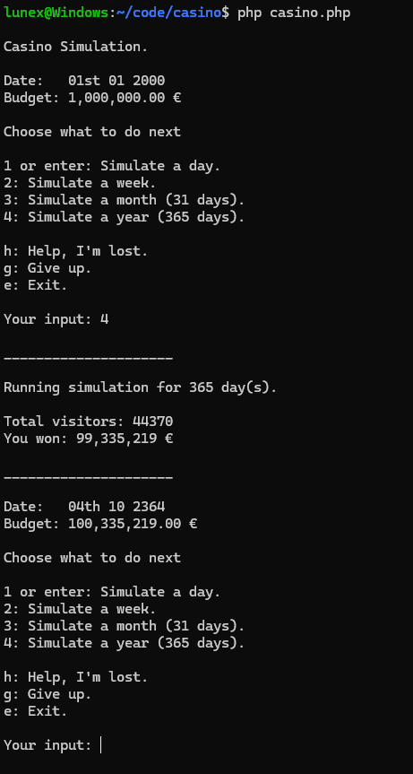

# Casino Simulation

A fun little idea to learn / improve on my PHP.

---

## run

CLI
```
php casino.php
```

---

## Showcase



---

## Maybe useful Information

Programmed on Windows WSL (Maybe important fo know if this doesn't work on your machine at first).

Only tested on my Windows machine. 

---

## Ideas / CANDOs:

[ ] Make odds harder for Casino (Looks like you can only win right now). Look up statistics for game win chances.

[ ] Test execution on Ubuntu

[ ] GUI or other ways to control this than CLI

[ ] User can add own timezone, budget & days to skip

[ ] Change Repo name to include simulation

[ ] Save & resume option

[ ] Able to play yourself (splitting up in multiple files)

[ ] Choose games to play

[ ] Make all options parameters

[ ] Make all options chooseable in the CLI

[ ] Write possibilities in help

[ ] Random Event: A visitor comes and plays with 1.000.000 EUR

[ ] User can type in how many days to simulate

[ ] Simulate until (maybe) a new digit is appended.

[ ] Print stats of each day

[ ] On Game Over show the stats of the day

[ ] Improve code

[ ] Write Tests